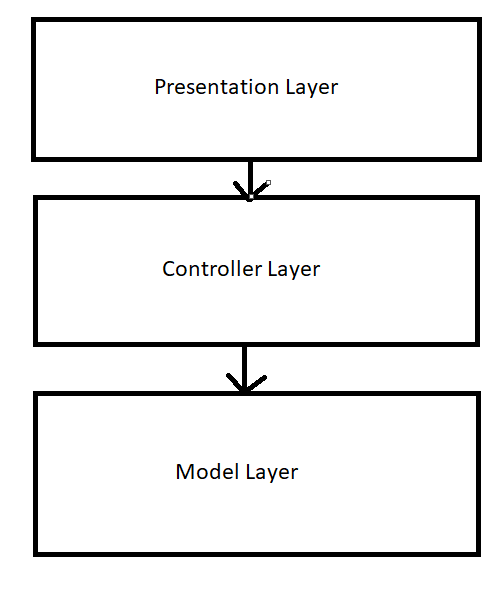

# Architektur

## Architekturmuster festlegen

**Schichtenarchitektur der Nähmaschinen-Software:**

  -Klare Trennung: Hardwarefunktionen (z. B. Pedal, LED) sind von der Anwendungslogik (Musterwahl, Parametersteuerung) und der Benutzeroberfläche (UI, Anzeige) getrennt.
  
  -Kapselung: Jede Schicht ist unabhängig testbar und ersetzbar.
  
  -Hierarchie: Jede Schicht greift ausschließlich auf die direkt darunterliegende zu; keine Querverbindungen zwischen nicht benachbarten Schichten.
  
  -Entkopplung: Funktionale Gruppen (Hardware, Logik, UI) sind streng voneinander abgegrenzt.

  

 

**Model-View-Controller (MVC)**:
Zweck: Trennung von Datenlogik, Darstellung und Steuerung.

Model (naehmaschine.model)

  -Naehmaschine.java: Zentrale Geschäftslogik
  -Verwaltet alle Einstellungen und Zustände
  -Implementiert PropertyChangeSupport für Observer Pattern
  -Enthält Validierungslogik für Parameter

Stichmuster.java: Datenklasse für Stichmuster

  -Immutable ID und Name
  -Mutable Parameter (Länge, Breite, Position)

LED.java & Pedal.java: Komponenten-Modelle

  -Eigene PropertyChangeSupport Instanzen
  -Kapseln spezifische Logik

## Komponentendiagramm

## Traceability - Matrix

| **Requirement** | **Komponenten**                                                               |
| ----------- | ------------------------------------------------------------------------- |
| F1.1        | Naehmaschine, Stichmuster, NaehmaschineView, DisplayPanel, DrehradPanel   |
| F1.2        | DrehradPanel, NaehmaschineView, NaehmaschineController, Naehmaschine      |
| F1.3        | Stichmuster, DrehradPanel, NaehmaschineController, DisplayPanel           |
| F1.4        | NaehmaschineView, DisplayPanel, Naehflaeche, NaehmaschineController       |
| F2.1        | Pedal, PedalPanel, NaehmaschineView, NaehmaschineController, Naehmaschine |
| F2.2        | Pedal, PedalPanel, Naehflaeche, NaehmaschineController                    |
| F2.3        | Pedal, PedalPanel, DisplayPanel, Naehmaschine                             |
| F3.1        | LED, LEDPanel, NaehmaschineView, NaehmaschineController, Naehmaschine     |
| F3.2        | LED, LEDPanel, DrehradPanel, NaehmaschineController                       |
| F3.3        | LED, LEDPanel, DrehradPanel, NaehmaschineController, DisplayPanel         |
| F4.1        | Naehmaschine, DrehradPanel, NaehmaschineController, DisplayPanel          |
| F4.3        | NaehmaschineView, DisplayPanel, NaehmaschineController, Naehmaschine      |
| F5.1        | Stichmuster, DrehradPanel, NaehmaschineController, DisplayPanel           |
| F5.2        | Stichmuster, DrehradPanel, NaehmaschineController, DisplayPanel           |
| F5.3        | DisplayPanel, NaehmaschineView, NaehmaschineController                    |

## Rollenverteilung im System

| **Komponente**             | **Aufgabe**                                                                                          |
| ---------------------- | ------------------------------------------------------------------------------------------------ |
| Naehmaschine           | Zentrales Model, verwaltet Stichmuster, Parameter, Pedal, LED und ihren Zustand                  |
| Stichmuster            | Datenobjekt für ein Stitchmuster, enthält Parameter wie Länge, Breite, Nadelposition             |
| LED                    | Model für LED-Zustand und Helligkeit, unterstützt Modi „Aus“, „Ein“ und „Automatisch“            |
| Pedal                  | Model für die Fußpedal-Position, berechnet Nähgeschwindigkeit                                    |
| NaehmaschineView       | Hauptfenster (GUI), enthält alle View-Komponenten, koordiniert Layout und Anzeige                |
| DisplayPanel           | Zeigt aktuelle Werte wie Stichmuster, Länge, Breite, Geschwindigkeit, Spannung                   |
| DrehradPanel           | Interaktives Drehrad für Auswahl/Einstellungen aller Parameter und Modi                          |
| PedalPanel             | Virtuelles Fußpedal zur Steuerung der Nähgeschwindigkeit                                         |
| LEDPanel               | Visualisiert LED-Status und Helligkeit in der GUI                                                |
| Naehflaeche            | Canvas für die visuelle Darstellung der Nähanimation und Stichmuster                             |
| NaehmaschineController | Vermittelt zwischen Model und View, verarbeitet Benutzereingaben und synchronisiert die Anzeigen |
| StichMusterRenderer    | Utility-Klasse für das technische Zeichnen/Rendern verschiedener Stichmuster                     |                                                    |

## Schnittstellendokumentation

| **Requirement** | **Komponente**        | **Schnittstelle**                                   | **Beschreibung**                                             |
| ----------- | ----------------- | ----------------------------------------------- | -------------------------------------------------------- |
| F1.1        | Model             | Naehmaschine.getVerfuegbareMuster()             | Liefert alle vorhandenen Stichmuster zurück              |
| F1.1        | Model             | Naehmaschine.getAktuellesStichmuster()          | Gibt das aktuell ausgewählte Stichmuster zurück          |
| F1.1        | View              | DisplayPanel.updateStichmuster(Stichmuster)     | Zeigt aktuelles Muster im Display an                     |
| F1.1        | DrehradPanel/View | DrehradListener.onStichmusterChanged(int)       | Event für Musterwechsel durch Drehrad-Bedienung          |
| F1.1        | Controller        | Naehmaschine.setStichmuster(int)                | Setzt das Muster im Model                                |
| F1.2        | DrehradPanel/View | Moduswahl-Button, Drehrad                       | Umschalten in Modus „Stichmuster“, Drehen ändert Auswahl |
| F1.3        | Model             | Stichmuster.get/setStichlaenge(double)          | Getter/Setter für Stichlänge des gewählten Musters       |
| F1.3        | Model             | Stichmuster.get/setStichbreite(double)          | Getter/Setter für Stichbreite des gewählten Musters      |
| F1.3        | Model             | Stichmuster.get/setPosition(Nadelposition)      | Getter/Setter für Nadelposition                          |
| F1.3        | DrehradPanel/View | DrehradListener.onStichlaengeChanged(double)    | Event für Stichlänge                                     |
| F1.3        | DrehradPanel/View | DrehradListener.onStichbreiteChanged(double)    | Event für Stichbreite                                    |
| F1.4        | View              | DisplayPanel.updateStichmuster(Stichmuster)     | Zeigt gewähltes Muster mit Nummer und Namen              |
| F1.4        | View              | Naehflaeche.setStichmuster(Stichmuster)         | Zeigt Muster visuell                                     |
| F2.1        | Model             | Pedal.setPosition(double)                       | Setzt Pedal-Stellung (0.0–1.0)                           |
| F2.1        | Model             | Pedal.getGeschwindigkeit()                      | Liest aktuelle Nähgeschwindigkeit aus                    |
| F2.1        | PedalPanel/View   | PedalListener.onPedalPressed(double)            | Event vom Bedienelement an Controller                    |
| F2.1        | Controller        | Naehmaschine.setPedalPosition(double)           | Übergibt Pedalwert ans Model                             |
| F2.2        | PedalPanel/View   | PedalListener.onPedalReleased()                 | Event für sofortiges Stoppen                             |
| F2.2        | Model             | Pedal.setPosition(0.0)                          | Pedal wird auf 0 gesetzt                                 |
| F2.2        | View              | Naehflaeche.stopSewing()                        | Beendet die Nähanimation                                 |
| F2.3        | Model             | Pedal.MAX_GESCHWINDIGKEIT = 1100.0              | Maximale Geschwindigkeit festgelegt                      |
| F2.3        | DisplayPanel/View | DisplayPanel.updateGeschwindigkeit(double)      | Zeigt aktuelle Geschwindigkeit                           |
| F3.1        | Model             | LED.getModus()/setModus(LEDModus)               | Getter/Setter für LED-Modus                              |
| F3.1        | View              | LEDPanel.setModus(LED.LEDModus)                 | Stellt dar, ob die LED leuchtet                          |
| F3.1        | View              | LEDPanel.setAktiv(boolean)                      | Schaltet LED-Licht optisch ein/aus                       |
| F3.2        | DrehradPanel/View | DrehradListener.onLEDModusChanged(LED.LEDModus) | Event für Moduswechsel LED durch Benutzer                |
| F3.2        | Controller        | LED.setModus(LEDModus)                          | Setzt LED-Modus (Aus/Ein/Automatisch) im Model           |
| F3.3        | Model             | LED.getHelligkeit()/setHelligkeit(int)          | Getter/Setter für LED-Helligkeitsstufe                   |
| F3.3        | View              | LEDPanel.setHelligkeit(int)                     | Darstellung der gewählten Helligkeitsstufe               |
| F4.1        | Model             | Naehmaschine.get/setFadenspannung(double)       | Getter/Setter für Fadenspannung                          |
| F4.1        | DrehradPanel/View | DrehradListener.onFadenspannungChanged(double)  | Event für Änderung der Fadenspannung                     |
| F4.3        | View              | DisplayPanel.updateFadenspannung(double)        | Fadenspannung im Display anzeigen                        |
| F5.1        | Model             | Stichmuster.get/setStichlaenge(double)          | Getter/Setter für Stichlänge                             |
| F5.1        | DrehradPanel/View | DrehradListener.onStichlaengeChanged(double)    | Event für Änderung der Stichlänge                        |
| F5.2        | Model             | Stichmuster.get/setStichbreite(double)          | Getter/Setter für Stichbreite                            |
| F5.2        | DrehradPanel/View | DrehradListener.onStichbreiteChanged(double)    | Event für Breitenänderung                                |
| F5.3        | View              | DisplayPanel.updateStichlaenge(double)          | Zeigt aktuelle Stichlänge im Display an                  |
| F5.3        | View              | DisplayPanel.updateStichbreite(double)          | Zeigt aktuelle Stichbreite im Display an                 |

